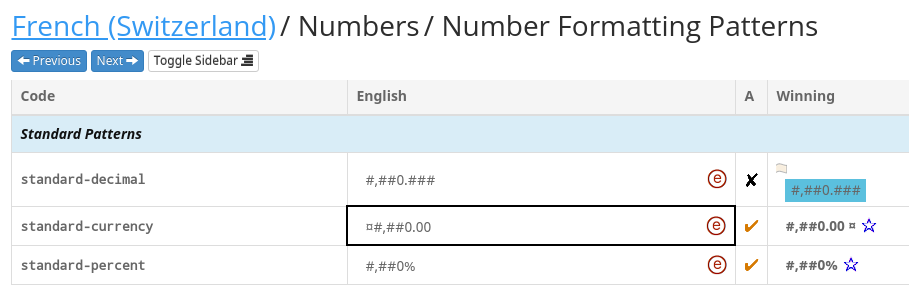
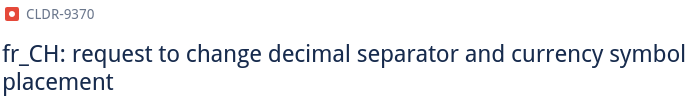
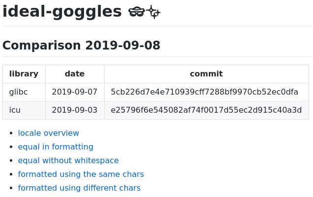
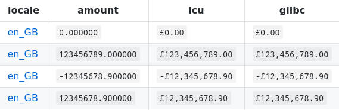
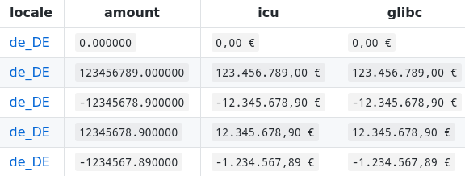
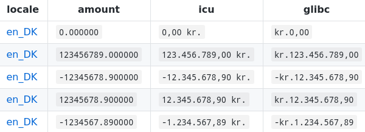
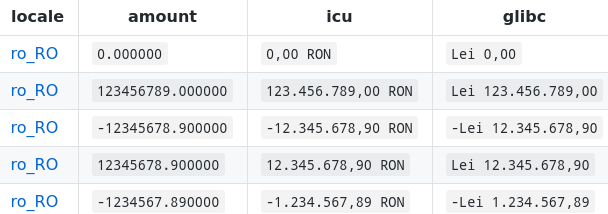
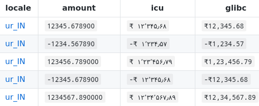
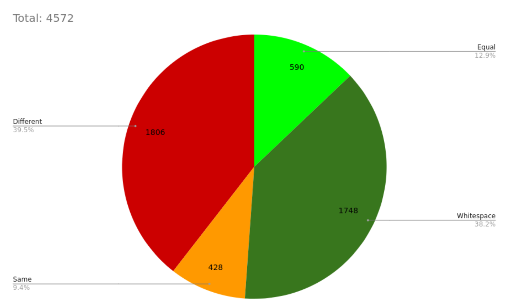

Du hast 5 Geld in der Schweitz<br />- wo ist dein Währungssymbol?

-v-

Was war noch gleich ne Locale?

Sprachen:

- ur: [Urdu](https://en.wikipedia.org/wiki/Urdu)
- pa: [Punjabi](https://en.wikipedia.org/wiki/Punjabi_language)
- ta: [Tamil](https://de.wikipedia.org/wiki/Tamil)

Regionen:

- IN: [India](https://en.wikipedia.org/wiki/India)
- LK: [Sri Lanka](https://en.wikipedia.org/wiki/Sri_Lanka)

<div class="fragment">ur_IN pa_IN ta_LK</div>

---

## Wer spielt mit?


-v-

### International Organization for Standardization


-v-

- Sprachcodes: [ISO 639](https://en.wikipedia.org/wiki/ISO_639)
  - Siehe nicht: Macrolanguages, Glottolog
- Ländercodes: [ISO 3166](https://en.wikipedia.org/wiki/ISO_3166)
  - Siehe nicht: `EU`
- Währungscodes: [ISO 4217](https://en.wikipedia.org/wiki/ISO_4217)
  - Siehe nicht: Cryptocurrencies (BTC vs. XBT), Metalle (XAU, XAG)

-v-

### Unicode-Konsortium


-v-

- Common Locale Data Repository: [CLDR](http://cldr.unicode.org/)
- International components for unicode: [ICU](http://site.icu-project.org/)

-v-

### GNU C Library (glibc)


-v-

- [glibc locales project](https://sourceware.org/glibc/wiki/Locales)
- [libc-locales](https://sourceware.org/ml/libc-locales/)

---

## Was wird gespielt?

- Ecommerce und es geht in die Schweitz
- Jemand versucht clever mit Software zu sein
- Product Owner: 'Please review currency symbol position in CH'

-v-

### Was heißt das, 'clever' sein?

- Das Unternehmen hat da eine API
  - Die ist aber nicht so richtig praktisch
- Browser können das doch auch? Da geht doch bestimmt etwas mit JavaScript?

-v-

#### Der Trick mit JavaScript

- `Intl.NumberFormat`
- `Number.prototype.toLocaleString`

```javascript
(5).toLocaleString('fr-CH', { currency: 'CHF', style: 'currency' });
```

- 5 Geld <!-- .element: class="fragment" -->
- in der Schweitz <!-- .element: class="fragment" -->
- wo ist das Währungssymbol? <!-- .element: class="fragment" -->

-v-

```javascript
(5).toLocaleString('fr-CH', { currency: 'CHF', style: 'currency' });
// Node v10.15.1:  'CHF 5.00'
// Node v12.1.0:   '5.00 CHF'
// Firefox 66.0.2: '5.00 CHF'
// Chrome 73.0.…:  '5.00 CHF'
// Safari 12.0.3:  '5.00 CHF'
// IE 11:          '5.00 fr.'
```

> Please review currency symbol position in CH

---

## Update, und gut ist?


… ja nu ¯\\\_(ツ)\_/¯

<!-- Es gibt Leute, die da stärker sind als ich,
und es gibt Boxer, die nicht mehr aufhören können.
Warum ist dein Währungssymbol? Woher wissen wir jetzt was richtig ist? -->

-v-

### ok, was ist passiert?

> Wilde Vermutung: es ist bestimmt die glibc!

```bash
# localedata/locales/fr_CH
LC_MONETARY
copy  "de_CH"
END LC_MONETARY

# localedata/locales/de_CH
LC_MONETARY
currency_symbol           "CHF"
…
p_cs_precedes             1
n_cs_precedes             1
…
END LC_MONETARY
```

-v-

…jetzt noch ein kurzes `git blame` und wir wissen bescheid!

```bash
git blame fr_CH; git blame de_CH
# > Ulrich Drepper 1997-03-05
```

OK: die glibc liegt tatsächlich anders!

Nicht OK: `1997-03-05` ist nicht zwischen `2018-04-24` und `2019-05-16`.

-v-

- Ok - glibc war falsch geraten
- Gucken wir doch mal den Sourcecode an
  - v8 yeah!

-v-

```c
// src/builtins/builtins-number.cc
// ES6 section 20.1.3.4 Number.prototype.toLocaleString…
…
Intl::NumberToLocaleString(…)
…

// src/objects/intl-objects.cc
// ecma402/#sup-properties-of-the-number-prototype-object
MaybeHandle<String> Intl::NumberToLocaleString(…) {
…
  icu::number::LocalizedNumberFormatter* icu_number_format =
      number_format->icu_number_formatter().raw();
…
}
```

-v-

Next up: ICU source


-v-

```bash
# since commit 3bfe134:
# icu4c/source/data/locales/fr_CH.txt
fr_CH{
    NumberElements{
        latn{
            patterns{
                currencyFormat{"#,##0.00 ¤ ;-#,##0.00 ¤"}
…
# icu4c/source/data/locales/de_CH.txt
de_CH{
…
                currencyFormat{"¤ #,##0.00;¤-#,##0.00"}
…
```

<!-- till commit e25796f -->

-v-

Beachtet diese Schönheit:

<h1>5¤</h1>

- U+00A4 currency sign
- 'Scarab'
- ISO 4217: `XXX`

<!-- the meta to our nook -->

---

#### Interlude

- Leute
- Internet
- Google Streetview

-v-


-v-


-v-


---

## Un🕴c�de

-v-

- fr_CH: `"#,##0.00 ¤ ;-#,##0.00 ¤"`
- de_CH: `"¤ #,##0.00;¤-#,##0.00"`
- [CLDR charts 32](https://unicode.org/cldr/charts/32/)

-v-

### Das Survey Tool



Repository: [github.com/unicode-org/cldr](https://github.com/unicode-org/cldr)

-v-

### Endlich ein Ticket



[CLDR-9370](https://unicode-org.atlassian.net/browse/CLDR-9370)

-v-


-v-

Federal Chancellery (via google translate):

> The number is written in three-digit increments …, and is followed
> (and never preceded) by the indication of the currency…

-v-

### glibc mailing list

1. Da ist anders - was ist richtig?
2. Da ist anders - ich glaub glibc ist falsch
3. ja nu ¯\\\_(ツ)\_/¯

Nachlesbar [hier](https://sourceware.org/ml/libc-locales/2019-q2/msg00050.html)

---


-v-

### Die Idee

Wir machen folgendes:

- alles selbst bauen
- ein paar Währungsbeträge generieren
- ein bischen automatisierter vergleichen

-v-

### Anschauen



-v-

#### equal formatting



-v-

#### equal without whitespace



> Liebe Grüße an den \&nbsp;

-v-

#### same chars



-v-

#### different 1



-v-

#### different 2



-v-

#### Stats



-v-

### Offene Fragen

- WTF `fr_CH`
- Streit suchen
- Mehr statistik bauen

---

## Danke!

- Für Support
- Für offene Ohren
- Für eure Aufmerksamkeit

-v-

- Slides, Quellen: [github.com/runjak/nook2019](https://github.com/runjak/nook2019)
- 🥽✨: [github.com/runjak/ideal-goggles](https://github.com/runjak/ideal-goggles)
- Spätere Fragen und Unfug: [@sicarius](https://twitter.com/sicarius)
